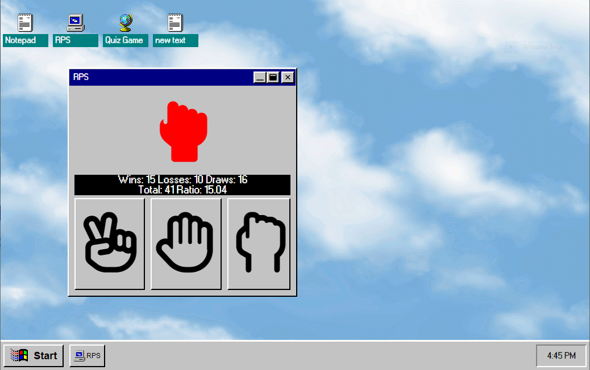

# fakeOS
This is a website I built to look like the Windows 95 opperating system,
I chose this OS because it was the first OS I ever used.



## [Github pages link](https://matt-pepper.github.io/fakeOS/)

## Technologies Used
- HTML
- SCSS
- JavaScript
- JQuery

### Challenges
Some challenges I faced while creating this website was, having standard components that can have dynamic content.
To solve this I make use of HTML Templates.

## Contributing
To make changes to this website there are a few steps needed to be taken.

1. to add new "app"
```
//icon.js
// Add icon, and app name in appType object
export const appType = [ {icon: 'imagepath', app: 'appname'} ]

// Add icon to desk top using iconList
export const iconList = [ {id:number, app: appType[index of new app], fileName: 'any name', content: [optional array for content]} ]

//window.js
// add app name to addApp switch statement, which needs to lead to a function that will append the new app to the parent element
export const assApp = (parent, appNum, app) => {
switch "new app" {
  createNewApp(parent);
  break;
  }
 }
 
 // In a new javascript file you need to append a template to the parent window element.
 ```
